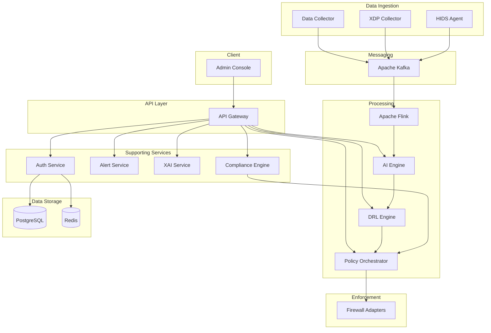

# SENTINEL: Software Architecture, Design, and Development

This document is the single entry point for understanding how the SENTINEL platform is built, why it is designed the way it is, and how to develop and extend it. It is intended for developers, architects, and operations staff.

## 1. Introduction

### 1.1 Purpose

This document explains:

- **Architecture** — What components exist and how they fit together.
- **Design** — Key design decisions and patterns.
- **Development** — How to build, run, test, and extend the project.

For detailed API, security, deployment, and ML model documentation, see [Related documentation](#6-related-documentation).

### 1.2 Product Summary

SENTINEL is an enterprise-grade, AI-powered security platform that provides:

- **Threat detection** via an ensemble of ML models (XGBoost, LSTM, Isolation Forest, Autoencoder) for known and zero-day threats.
- **Automated policy decisions** using a Deep Reinforcement Learning (DRL) engine that outputs ALLOW, DENY, RATE_LIMIT, QUARANTINE, or MONITOR.
- **Policy enforcement** through multiple firewall adapters (iptables, nftables, AWS, Azure, GCP).
- **Compliance management** with built-in frameworks (GDPR, HIPAA, PCI-DSS, NIST CSF).
- **System hardening** and host-based intrusion detection (HIDS) for endpoint security.
- **Explainable AI (XAI)** with SHAP-based explanations for every detection.

---

## 2. Software Architecture

### 2.1 System Overview

All user and client traffic enters through the Admin Console (React) and the API Gateway. The gateway authenticates requests and routes them to backend services. Data flows from network and host collectors into Kafka; stream processing (Flink) and the AI engine consume it for detection; the DRL engine and Policy Orchestrator produce and enforce firewall rules. Supporting services (Auth, Alert, Compliance, XAI) provide identity, notifications, compliance reports, and explanations.

In the default deployment, the AI engine is invoked via HTTP (e.g. by the data-collector or via the gateway’s `/api/v1/detect` proxy). The Kafka → Flink → features → AI path is optional and requires Flink to be running.



### 2.2 Component View

| Layer | Component | Description |
|-------|-----------|-------------|
| **Data ingestion** | **data-collector** | Captures traffic via PCAP, NetFlow v5/v9, sFlow; normalizes to CIM; publishes to Kafka. |
| | **xdp-collector** | High-speed capture using XDP/eBPF at the driver layer; lower latency and higher throughput than PCAP. |
| | **hids-agent** | Host-based intrusion detection: file integrity, process monitoring, rootkit detection; events to Kafka. |
| **API layer** | **api-gateway** | Single entry point: authentication (JWT), rate limiting, routing to backend services. |
| **Backend services** | **auth-service** | User identity, JWT issue/verify, RBAC (Admin, Analyst, Operator, Viewer). |
| | **ai-engine** | ML threat detection: XGBoost, LSTM, Isolation Forest, Autoencoder, stacking ensemble; loads models from `trained_models/`. |
| | **drl-engine** | PPO agent: state from threat context, actions ALLOW/DENY/RATE_LIMIT/QUARANTINE/MONITOR; policy optimization. |
| | **policy-orchestrator** | Converts DRL/output decisions into firewall rules; validates; delegates to vendor adapters. |
| | **alert-service** | Alert management, notifications (email, optional Slack), acknowledgment and resolution. |
| | **compliance-engine** | GDPR, HIPAA, PCI-DSS, NIST CSF assessments and policy mapping. |
| | **xai-service** | SHAP explainability and audit trails for detections. |
| | **hardening-service** | OS/server hardening (SSH, kernel, services, firewall baseline, user config). |
| **Data stores** | **PostgreSQL** | Primary database: users, threats, policies, network_logs, compliance state. |
| | **Redis** | Cache, sessions, rate-limit state, optional config cache. |
| | **Kafka** | Event streaming: normalized_traffic, alerts, features (produced by collectors/Flink; consumed by Flink/AI). |
| **Stream processing** | **Flink jobs** | Feature extraction (tumbling/sliding/session windows), anomaly detection; reads from Kafka, writes features. |
| **Frontend** | **admin-console** | React 18 + TypeScript + Vite dashboard: login, dashboard, threats, policies, compliance, settings. |
| **Enforcement** | **firewall-adapters** | iptables, nftables, AWS Security Groups, Azure NSG, GCP Firewall; translate universal rules to vendor syntax. |

### 2.3 Data Flow

End-to-end flow from capture to enforcement:

1. **Capture** — Data Collector and/or XDP Collector (and optionally HIDS) capture network/host events.
2. **Normalize** — Data Collector normalizes to a Common Information Model (CIM) and publishes to Kafka (`normalized_traffic`, etc.).
3. **Stream process** — Flink jobs consume Kafka, compute features (statistical, behavioral), optionally anomaly scores; publish to `features` (or equivalent) topics.
4. **Detect** — AI Engine consumes features (or receives them via API), runs ensemble (XGBoost, LSTM, Isolation Forest, Autoencoder), produces threat score and label.
5. **Decide** — DRL Engine takes threat context (score, reputation, asset criticality, etc.), PPO agent outputs action (ALLOW, DENY, RATE_LIMIT, etc.).
6. **Translate** — Policy Orchestrator turns the decision into a universal firewall rule, validates it, selects adapter (iptables, AWS, etc.).
7. **Enforce** — The chosen firewall adapter applies the rule on the target (host or cloud).
8. **Explain & comply** — XAI Service provides SHAP explanations; Compliance Engine maps actions to regulatory controls.

See [architecture.md](architecture.md) for the full “Data Flow” section.

### 2.4 Deployment View

- **Primary:** Docker Compose ([docker-compose.yml](../docker-compose.yml)) runs all services locally or on a single host. Use `.env` (from [.env.example](../.env.example)) for configuration.
- **Production:** Use [docker-compose.prod.yml](../docker-compose.prod.yml) with the reverse proxy (Nginx) for TLS termination; see [deployment-guide.md](deployment-guide.md).
- **Cloud:** Terraform in [infrastructure/terraform](../infrastructure/) provisions AWS (VPC, RDS, ElastiCache, MSK, ECS, ALB). Same docs reference optional SageMaker for ML.
- **Monitoring:** [monitoring/](../monitoring/) provides Prometheus, Grafana, and Redis exporter; see `docker-compose.monitoring.yml` and `prometheus/prometheus.yml`, `grafana/provisioning/datasources/`.

### 2.5 Technology Stack

| Component | Technology |
|-----------|------------|
| Backend services | Python 3.10+, Flask |
| Message queue | Apache Kafka |
| Stream processing | Apache Flink |
| ML/DL | PyTorch, XGBoost, scikit-learn |
| RL | Stable-Baselines3, Gymnasium |
| Database | PostgreSQL, Redis |
| Frontend | React 18, TypeScript, Vite, Tailwind CSS |
| Infrastructure | Docker Compose, Terraform (AWS) |
| Observability | Prometheus, Grafana |

---

## 3. Design

### 3.1 Design Principles

- **Microservices** — Each capability (auth, AI, DRL, policy, alert, compliance, XAI, hardening, collectors) is a separate service for independent scaling and deployment.
- **Event-driven** — Kafka decouples producers (collectors, Flink) from consumers (Flink, AI engine); supports replay and multiple consumers.
- **Single API entry** — All client traffic goes through the API Gateway for authentication, rate limiting, and routing.
- **RBAC** — Role-based access control (Admin, Analyst, Operator, Viewer) enforced at the gateway and services.

### 3.2 Key Design Decisions

| Decision | Rationale |
|----------|-----------|
| **Two collectors (PCAP vs XDP)** | **Data Collector** (PCAP/NetFlow/sFlow) offers flexibility and broad compatibility. **XDP Collector** processes packets at the driver layer for high throughput and low latency. Use XDP when line-rate capture is required; use Data Collector for rich protocols and easier deployment. |
| **Ensemble (XGBoost + LSTM + Isolation Forest + Autoencoder)** | XGBoost handles known threat types; LSTM captures temporal/sequence patterns; Isolation Forest and Autoencoder provide unsupervised anomaly detection for zero-day and novel attacks. Combined via a stacking ensemble with calibrated weights. |
| **DRL for policy** | Automating allow/deny/rate-limit from threat context avoids static rule sets and adapts to risk in real time. PPO is used for stability and continuous action spaces. |
| **Multiple firewall adapters** | On-host enforcement (iptables, nftables) and cloud (AWS Security Groups, Azure NSG, GCP Firewall) are supported through a single rule abstraction; new vendors can be added by implementing the adapter interface. |

### 3.3 Interfaces

- **REST API** — The API Gateway exposes `/api/v1/*` and proxies to the corresponding backend services: `/api/v1/auth/*` (Auth), `/api/v1/threats` (Data Collector), `/api/v1/alerts` (Alert Service), `/api/v1/policies` (Policy Orchestrator), `/api/v1/frameworks`, `/api/v1/assess`, etc. (Compliance Engine), `/api/v1/explain/*`, `/api/v1/audit-trail` (XAI Service), `/api/v1/detect` (AI Engine), `/api/v1/decide` (DRL Engine), plus config and statistics. See [api-reference.md](api-reference.md) and [API.md](API.md) for endpoints and payloads.
- **Events** — Kafka topics:
  - **Producers:** Data Collector, XDP Collector, HIDS agent (normalized traffic/events); Flink (features).
  - **Consumers:** Flink (traffic → features); AI engine can consume features or be called via API with precomputed features.

### 3.4 Security Design

- **Authentication:** JWT (access + refresh); tokens verified at the gateway.
- **Authorization:** RBAC with roles (Admin, Security analyst, Auditor, Operator, Viewer); enforced per endpoint.
- **Encryption:** TLS for external and inter-service communication; encryption at rest for DB and sensitive storage.
- **Network isolation:** In AWS, VPC with public/private subnets; security groups limit access.

Full details: [security.md](security.md).

### 3.5 ML/DRL Design

- **Ensemble:** Weights and threshold are calibrated during training; config stored in `trained_models/ensemble/ensemble_config.json`; AI engine loads it at startup.
- **PPO:** State vector (threat score, reputation, asset criticality, etc.), discrete action space (ALLOW, DENY, RATE_LIMIT_*, QUARANTINE_*, MONITOR), reward balances security vs availability; policy and value networks saved under `trained_models/drl/`.
- **Model loading:** All detectors (XGBoost, LSTM, Isolation Forest, Autoencoder) and the ensemble load from `MODEL_PATH` (e.g. `backend/ai-engine/trained_models/`).

Full details: [ml-models.md](ml-models.md).

---

## 4. Development

### 4.1 Repository Structure

```
sentinel-core/
├── backend/                    # Python Flask microservices
│   ├── ai-engine/              # ML threat detection (ensemble, inference, learning)
│   ├── alert-service/         # Alerts and notifications
│   ├── api-gateway/            # Central API gateway
│   ├── auth-service/           # Authentication and RBAC
│   ├── compliance-engine/      # Compliance frameworks (GDPR, HIPAA, PCI-DSS, NIST)
│   ├── data-collector/         # PCAP, NetFlow, sFlow capture and CIM normalization
│   ├── drl-engine/             # PPO policy engine
│   ├── firewall-adapters/      # Shared adapter interface (iptables, nftables, AWS, Azure, GCP)
│   ├── hardening-service/     # OS/server hardening
│   ├── hids-agent/             # Host-based intrusion detection
│   ├── policy-orchestrator/    # Policy-to-rule translation and validation
│   ├── xai-service/            # Explainable AI (SHAP)
│   ├── xdp-collector/          # XDP/eBPF high-speed capture
│   ├── tests/                  # Backend integration/unit tests
│   └── requirements-test.txt  # Test dependencies
├── frontend/
│   └── admin-console/          # React dashboard (Vite, TypeScript, Tailwind)
├── stream-processing/
│   └── flink-jobs/             # Flink feature extraction and anomaly jobs
├── training/                   # ML/DRL training pipeline and datasets
├── infrastructure/
│   └── terraform/              # AWS infrastructure as code
├── monitoring/                 # Prometheus, Grafana, Redis exporter
├── reverse-proxy/              # Nginx config for production TLS
├── docs/                       # Documentation (this file and others)
├── docker-compose.yml          # Default Compose stack
├── docker-compose.prod.yml     # Production overrides
├── init.sql                    # PostgreSQL schema
└── .env.example                # Environment variable template
```

### 4.2 Prerequisites

- Docker and Docker Compose v2+
- Node.js 18+ (for frontend)
- Python 3.10+ (for backend and training)
- Optional: GPU (CUDA) for LSTM, Autoencoder, and DRL training

### 4.3 Build and Run

**Quick start (all services):**

```bash
cd sentinel-core
cp .env.example .env
# Edit .env (passwords, JWT secret, etc.)
docker compose up -d
```

- Admin Console: http://localhost:3000  
- API Gateway: http://localhost:8080  
- API docs: http://localhost:8080/docs  

**Frontend only (local dev):**

```bash
cd sentinel-core/frontend/admin-console
npm install
npm run dev
```

**Backend (single service):**

```bash
cd sentinel-core/backend/<service>
python -m venv venv
source venv/bin/activate   # or venv\Scripts\activate on Windows
pip install -r requirements.txt
python app.py
```

Ensure PostgreSQL, Redis, and optionally Kafka are running (e.g. via `docker compose up -d postgres redis kafka`). See [SETUP.md](../SETUP.md) and [deployment-guide.md](deployment-guide.md) for full steps and production reverse proxy.

### 4.4 Testing

- **Frontend:** Vitest + React Testing Library; run with `npm run test` in `frontend/admin-console`.
- **Backend:** pytest in `backend/`; run with `python -m pytest tests/ -v` from `backend/`.
- **E2E:** Playwright in `frontend/admin-console`; run with `npm run test:e2e`.
- **CI:** GitHub Actions in [.github/workflows/ci.yml](../../.github/workflows/ci.yml) (frontend type-check, lint, unit tests; backend pytest; optional training job).

### 4.5 Training Pipeline

- **Data:** Place CIC-IDS2018 or UNSW-NB15 under `training/datasets/data/`; see [training/README.md](../training/README.md) for layout and download links.
- **Run:** From `sentinel-core`:
  - All models: `python training/train_all.py --data-path training/datasets/data --dataset cicids2018`
  - Specific models: `--models xgboost isolation_forest`
  - Limit rows (CI/small runs): `--max-rows 5000 --device cpu`
- **Outputs:** Models and configs are written to `backend/ai-engine/trained_models/` (xgboost, lstm, isolation_forest, autoencoder, ensemble, drl). Set `MODEL_PATH` for the AI engine to this directory (or its mounted path in Docker).

### 4.6 Extending the System

| Extension | Where | What to do |
|-----------|--------|-------------|
| **New firewall adapter** | [backend/firewall-adapters/](../backend/firewall-adapters/) | Implement the base adapter interface (e.g. inherit from `BaseFirewallAdapter`), implement `apply_rule`, `remove_rule`, etc.; register in the factory. |
| **New ML model** | [backend/ai-engine/](../backend/ai-engine/) | Add a detector class (load/save, predict); add a training script in `training/scripts/`; in `ai-engine` `initialize_models()`, instantiate and add to detectors/ensemble. |
| **New compliance framework** | [backend/compliance-engine/frameworks/](../backend/compliance-engine/frameworks/) | Add a module that implements the base framework interface; register and expose via compliance-engine API. |

---

## 5. Appendix

### 5.1 Glossary

| Term | Meaning |
|------|--------|
| **CIM** | Common Information Model; normalized schema for network/host events. |
| **DRL** | Deep Reinforcement Learning. |
| **IDS** | Intrusion Detection System. |
| **PPO** | Proximal Policy Optimization (RL algorithm). |
| **XDP** | eXpress Data Path; kernel hook for early packet processing (eBPF). |
| **XAI** | Explainable AI. |

### 5.2 Key Environment Variables

| Variable | Description |
|----------|-------------|
| `JWT_SECRET_KEY` | Secret for signing JWTs (required). |
| `POSTGRES_*` | Database name, user, password, port. |
| `REDIS_URL` | Redis connection URL. |
| `KAFKA_BOOTSTRAP_SERVERS` | Kafka broker list. |
| `ADMIN_USERNAME`, `ADMIN_PASSWORD`, `ADMIN_EMAIL` | Initial admin user. |
| `AI_ENGINE_URL`, `DRL_ENGINE_URL`, `POLICY_SERVICE_URL` | Backend URLs for gateway/service calls. |
| `MODEL_PATH` | Directory containing `trained_models/` for the AI engine. |
| `AUTH_SERVICE_URL`, `DATA_COLLECTOR_URL`, `ALERT_SERVICE_URL` | Used by API gateway to proxy requests. |

See [.env.example](../.env.example) for the full list.

---

## 6. Related Documentation

| Document | Description |
|----------|-------------|
| [architecture.md](architecture.md) | Detailed architecture and data flow. |
| [api-reference.md](api-reference.md) | API endpoints and examples. |
| [API.md](API.md) | Additional API documentation. |
| [deployment-guide.md](deployment-guide.md) | Local and production deployment. |
| [security.md](security.md) | Security architecture and controls. |
| [ml-models.md](ml-models.md) | ML/DRL models and training. |
| [disaster-recovery.md](disaster-recovery.md) | Backup and restore. |
| [scaling-guide.md](scaling-guide.md) | Horizontal scaling and capacity. |
| [SETUP.md](../SETUP.md) | Step-by-step setup. |
| [TROUBLESHOOTING.md](../TROUBLESHOOTING.md) | Common issues and fixes. |
| [training/README.md](../training/README.md) | Training pipeline and datasets. |
